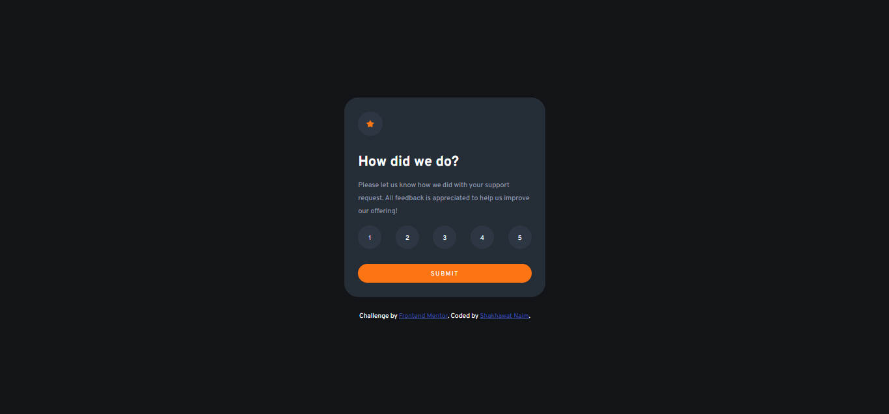

# Frontend Mentor - Interactive rating component solution

This is a solution to the [Interactive rating component challenge on Frontend Mentor](https://www.frontendmentor.io/challenges/interactive-rating-component-koxpeBUmI). Frontend Mentor challenges help you improve your coding skills by building realistic projects.

## Overview

Interactive rating component, a challenge from Frontend Mentor

- This is a nice, small project to practice handling user interactions and updating the DOM. Perfect for anyone who has learned the basics of JavaScript!

### The challenge

Users should be able to:

- View the optimal layout for the app depending on their device's screen size
- See hover states for all interactive elements on the page
- Select and submit a number rating
- See the "Thank you" card state after submitting a rating

### Screenshot

### Links

- Solution URL: [Solution URL here](https://github.com/ShakhawatNaim/Interactive-rating-component.git)
- Live Site URL: [Live site URL here](https://shakhawatnaim.github.io/Interactive-rating-component/)

## My process

### Built with

- Semantic HTML5 markup
- CSS custom properties
- Flexbox
- JavaScript

## Author

- Github - [Shakhawat Naim](https://github.com/ShakhawatNaim)
- Frontend Mentor - [@ShakhawatNaim](https://www.frontendmentor.io/profile/ShakhawatNaim)
- Linkedin - [@shakhawatnaim](https://www.linkedin.com/in/shakhawatnaim/)
